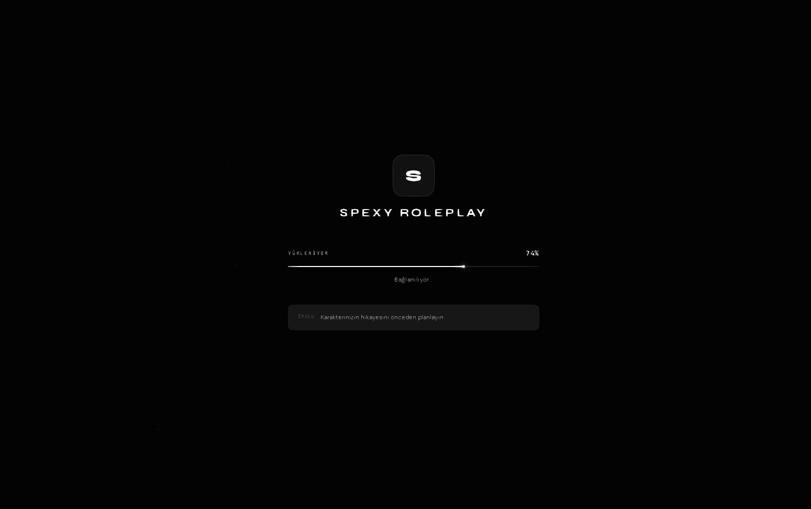

# spexy-loading

A clean, minimal loading screen built for FiveM roleplay servers. Designed and developed by hand with attention to detail — no templates, no generators.

Compatible with both QBCore and QBox frameworks.



---

## Features

- Collapsible left panel with Discord profile and server rules
- Always-visible online player count pulled from FiveM API
- Centered server identity with logo and loading bar
- Animated particle background (switchable via config)
- Background types: solid color, image, slideshow, video, particles
- Music support with autoplay and volume control
- Tip rotation system
- Discord social link
- Full TR / EN language support
- All colors, fonts, rules, links and settings configurable from a single file
- Mouse cursor fix for FiveM NUI environment
- QBCore and QBox compatible manifest

---

## Installation

1. Download and extract the `spexy-loading` folder.
2. Place it inside your server's `resources` directory.
3. Add the following line to your `server.cfg`:

```
ensure spexy-loading
```

Make sure `spexy-loading` is started before `spawnmanager` and other core resources.

---

## Configuration

All settings are controlled from a single file:

```
html/js/config.js
```

### Server Info

```js
server: {
    name: "YOUR SERVER NAME",
    logo: "assets/img/logo.png",
    cfxId: "your_cfx_id",
    maxPlayers: 64,
}
```

### Background

```js
background: {
    type: "particles", // "color" | "image" | "slideshow" | "video" | "particles"
    images: ["assets/img/bg1.jpg"],
    video: "assets/img/bg.mp4",
    particleCount: 60,
}
```

### Colors

```js
colors: {
    background: "#0a0a0a",
    text: "#ffffff",
    loadingBar: "#ffffff",
    // all values are CSS color strings
}
```

### Music

```js
music: {
    enabled: true,
    autoPlay: true,
    volume: 0.3,
    tracks: ["assets/music/track1.mp3"],
}
```

### Language

```js
language: "tr", // "tr" or "en"
```

---

## File Structure

```
spexy-loading/
├── fxmanifest.lua
├── preview.png
├── README.md
└── html/
    ├── index.html
    ├── css/
    │   └── style.css
    ├── js/
    │   ├── config.js
    │   └── app.js
    └── assets/
        ├── img/
        │   ├── logo.png
        │   └── bg1.jpg
        └── music/
            └── track1.mp3
```

---

## Asset Guidelines

| Asset | Recommended Format | Notes |
|---|---|---|
| Logo | PNG, 256x256 | Transparent background preferred |
| Background image | JPG/WEBP | 1920x1080 minimum |
| Music | MP3 or OGG | Keep under 8MB for fast loading |

---

## Notes

- The `cfxId` field is required for live player count. Find yours at [https://servers.fivem.net](https://servers.fivem.net)
- Music autoplay may be blocked by the browser until the first user interaction. The resource handles this automatically.
- The left panel can be opened and closed using the hamburger button in the top-left corner.

---

## License

This project was built and is maintained by Spexy Development.  
You may use and modify it for your own server. Redistribution or resale without permission is not allowed.

---

&nbsp;

---

# spexy-loading (Turkce)

FiveM roleplay sunucular icin sifirdan tasarlanmis, sade ve minimalist bir loading screen. Sabir ve dikkatle elle yazilmistir — hicbir sablon veya uretec kullanilmamistir.

Hem QBCore hem de QBox framework'leri ile uyumludur.


---

## Ozellikler

- Discord profili ve sunucu kurallari icin acilir kapanir sol panel
- FiveM API'sinden cekilen, her zaman gorunur online oyuncu sayisi
- Logo ve yukleme cubugu ile tam ortali sunucu kimlik alani
- Animasyonlu parcacik arka plani (config'den degistirilebilir)
- Arka plan tipleri: duz renk, resim, slayt gosterisi, video, parcaciklar
- Otomatik oynatma ve ses kontrolu ile muzik destegi
- Ipucu dongusu
- Discord sosyal linki
- Tam TR / EN dil destegi
- Tum renkler, fontlar, kurallar, linkler ve ayarlar tek bir dosyadan yonetilebilir
- FiveM NUI ortami icin mouse cursor duzeltmesi
- QBCore ve QBox uyumlu manifest

---

## Kurulum

1. `spexy-loading` klasorunu indirin ve cikarin.
2. Sunucunuzun `resources` dizinine yerlestirin.
3. `server.cfg` dosyaniza su satiri ekleyin:

```
ensure spexy-loading
```

`spexy-loading` in `spawnmanager` ve diger temel resource'lardan once baslatiladigina emin olun.

---

## Yapilandirma

Tum ayarlar tek bir dosyadan kontrol edilir:

```
html/js/config.js
```

### Sunucu Bilgileri

```js
server: {
    name: "SUNUCU ADINIZ",
    logo: "assets/img/logo.png",
    cfxId: "cfx_id_niz",
    maxPlayers: 64,
}
```

### Arka Plan

```js
background: {
    type: "particles", // "color" | "image" | "slideshow" | "video" | "particles"
    images: ["assets/img/bg1.jpg"],
    video: "assets/img/bg.mp4",
    particleCount: 60,
}
```

### Renkler

```js
colors: {
    background: "#0a0a0a",
    text: "#ffffff",
    loadingBar: "#ffffff",
}
```

### Muzik

```js
music: {
    enabled: true,
    autoPlay: true,
    volume: 0.3,
    tracks: ["assets/music/track1.mp3"],
}
```

### Dil

```js
language: "tr", // "tr" veya "en"
```

---

## Dosya Yapisi

```
spexy-loading/
├── fxmanifest.lua
├── preview.png
├── README.md
└── html/
    ├── index.html
    ├── css/
    │   └── style.css
    ├── js/
    │   ├── config.js
    │   └── app.js
    └── assets/
        ├── img/
        │   ├── logo.png
        │   └── bg1.jpg
        └── music/
            └── track1.mp3
```

---

## Dosya Onerileri

| Dosya | Onerilen Format | Notlar |
|---|---|---|
| Logo | PNG, 256x256 | Seffaf arka plan tercih edilir |
| Arka plan gorseli | JPG/WEBP | Minimum 1920x1080 |
| Muzik | MP3 veya OGG | Hizli yukleme icin 8MB alti tutun |

---

## Notlar

- Canli oyuncu sayisi icin `cfxId` alani gereklidir. ID'nizi [https://servers.fivem.net](https://servers.fivem.net) adresinden bulabilirsiniz.
- Muzik otomatik oynatma, ilk kullanici etkilesiminden once tarayici tarafindan engellenebilir. Resource bunu otomatik olarak yonetir.
- Sol panel, sol ust kosedeki hamburger dugmesi kullanilarak acilip kapatilabilir.

---

## Lisans

Bu proje Spexy Development tarafindan gelistirilmis ve surdurulen bir calismadir.  
Kendi sunucunuz icin kullanabilir ve degistirebilirsiniz. Izin alinmadan yeniden dagitim veya satisi yasaktir.
